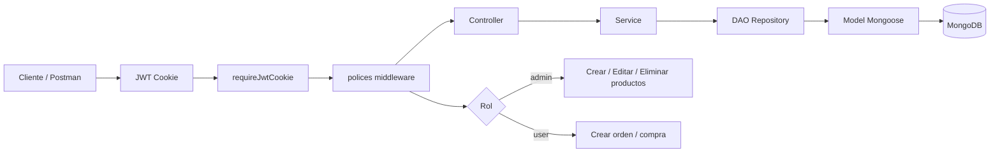
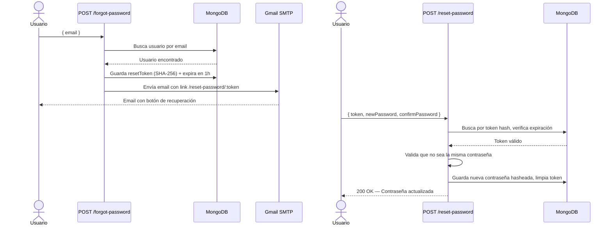

# BackEnd2 — Entrega Final

> Proyecto desarrollado durante el curso **CoderHouse Backend** (comisión 77080).  
> Servidor RESTful con Node.js + Express + MongoDB, con autenticación múltiple, roles, mailing y lógica de ecommerce.

---

## 🗂 Estructura del Proyecto

```
BackEnd2/
├── app.js                         # Punto de entrada
├── .env                           # Variables de entorno (no subir al repo)
├── package.json
└── src/
    ├── config/
    │   ├── auth/passport.config.js   # Estrategias Passport (Local, GitHub, JWT)
    │   ├── db/connect.config.js      # Conexión a MongoDB
    │   └── env/env.config.js         # Carga y validación de variables de entorno
    ├── controllers/
    │   ├── mailer.controller.js
    │   ├── messaging.controller.js
    │   ├── order.controller.js
    │   ├── product.controller.js
    │   └── student.controller.js
    ├── dao/
    │   ├── base.dao.js               # DAO genérico con CRUD base
    │   ├── order.mongo.dao.js
    │   ├── product.mongo.dao.js
    │   └── student.mongo.dao.js
    ├── middleware/
    │   ├── auth.middleware.js        # requireLogin, requireJWT, requireJwtCookie
    │   ├── logger.middleware.js
    │   └── polices.middleware.js     # Control de roles
    ├── models/
    │   ├── order.model.js
    │   ├── product.model.js
    │   ├── student.model.js
    │   ├── user.model.js
    │   └── dto/
    │       ├── student.dto.js
    │       └── user.dto.js           # DTO seguro (sin password ni githubId)
    ├── router/
    │   ├── router.padre.js           # Montaje centralizado de rutas
    │   └── routes/
    │       ├── auth.router.js        # Register, Login, Logout, Current, Forgot/Reset Password
    │       ├── order.router.js
    │       ├── product.router.js
    │       ├── mailer.router.js
    │       ├── messaging.router.js
    │       └── ...
    ├── services/
    │   ├── mailer.service.js
    │   ├── messaging.service.js
    │   ├── order.service.js          # Incluye validación de stock
    │   ├── product.service.js
    │   └── student.service.js
    ├── views/
    │   └── emails/
    │       ├── welcome.handlebars
    │       ├── order-status.handlebars
    │       └── password-reset.handlebars
    └── server/
        └── server.app.js            # Config de Express, middlewares y Handlebars
```

---

## 🏗 Arquitectura

El proyecto aplica una **arquitectura en capas** con separación de responsabilidades:

| Capa | Responsabilidad |
|------|-----------------|
| **Router** | Recibe requests HTTP y delega al Controller |
| **Controller** | Valida entrada, llama al Service y responde |
| **Service** | Lógica de negocio (validaciones, reglas) |
| **DAO** | Acceso a base de datos (patrón Repository) |
| **Model** | Definición del esquema con Mongoose |
| **DTO** | Transformación y validación de datos públicos |
| **Middleware** | Autenticación, autorización y logging |

---

## 🔐 Autenticación

El servidor soporta **tres estrategias de autenticación**:

| Estrategia | Descripción |
|------------|-------------|
| **Session (Passport Local)** | Login con email y contraseña, sesión persistida en MongoDB |
| **GitHub OAuth2** | Login con cuenta GitHub mediante Passport |
| **JWT (Cookie o Header)** | Token firmado, enviado como cookie o en `Authorization: Bearer` |

---

## 👥 Roles y Autorización

| Rol | Permisos |
|-----|----------|
| `user` | Ver productos, crear órdenes, ver sus datos |
| `admin` | Todo lo anterior + crear/editar/eliminar productos y órdenes |
| `premium` | Reservado para futuras extensiones |

El middleware `polices(...roles)` protege cada endpoint según el rol del usuario autenticado.

---

## 📦 Funcionalidades

### ✅ Implementadas

- **Registro y Login** de usuarios con hash de contraseña (bcrypt)
- **Login con GitHub** OAuth2
- **Login con JWT** y cookie segura
- **Ruta `/api/auth/current`** — devuelve datos del usuario autenticado con DTO (sin password)
- **Recuperación de contraseña** por email con token de 1 hora de expiración
- **Validación** de que la nueva contraseña no sea igual a la anterior
- **CRUD de Productos** con stock (solo admin)
- **CRUD de Órdenes** con cálculo automático de total
- **Validación de stock** antes de crear una orden
- **Descuento automático de stock** al confirmar una compra
- **Envío de emails** con Nodemailer y plantillas Handlebars
- **DAO + Repository Pattern** — `BaseDAO` genérico extendido por cada entidad
- **DTOs** — `user.dto.js` y `student.dto.js` para proteger datos sensibles
- **Paginación** en listados de órdenes y productos

---

## 🌐 Endpoints Principales

### Autenticación — `/api/auth`

| Método | Ruta | Auth | Descripción |
|--------|------|------|-------------|
| POST | `/register` | ❌ | Registrar usuario |
| POST | `/login` | ❌ | Login con sesión |
| POST | `/logout` | Session | Cerrar sesión |
| GET | `/current` | Session o JWT | Datos del usuario (DTO seguro) |
| POST | `/jwt/login` | ❌ | Login con JWT |
| GET | `/github` | ❌ | Login con GitHub |
| POST | `/forgot-password` | ❌ | Solicitar recuperación por email |
| POST | `/reset-password` | ❌ | Restablecer contraseña con token |

### Productos — `/api/products`

| Método | Ruta | Rol | Descripción |
|--------|------|-----|-------------|
| GET | `/api/products` | user/admin | Listar productos (paginado) |
| GET | `/api/products/:id` | user/admin | Obtener producto |
| POST | `/api/products` | **admin** | Crear producto |
| PUT | `/api/products/:id` | **admin** | Actualizar producto |
| DELETE | `/api/products/:id` | **admin** | Eliminar producto |

### Órdenes — `/api/orders`

| Método | Ruta | Rol | Descripción |
|--------|------|-----|-------------|
| GET | `/api/orders` | admin | Listar órdenes (paginado) |
| GET | `/api/orders/:id` | user/admin | Obtener orden por ID |
| POST | `/api/orders` | user/admin | Crear orden (valida stock) |
| PUT | `/api/orders/:id` | **admin** | Actualizar orden |
| DELETE | `/api/orders/:id` | **admin** | Eliminar orden |

### Emails — `/api/mail`

| Método | Ruta | Descripción |
|--------|------|-------------|
| POST | `/api/mail/welcome` | Enviar email de bienvenida |
| POST | `/api/mail/order-status` | Enviar email de estado de orden |

---

## 🔄 Flujo de la Aplicación




---

## 🔑 Flujo de Recuperación de Contraseña



---

## ⚙️ Variables de Entorno

Crear un archivo `.env` en la raíz con las siguientes variables:

```env
# Servidor
PORT=8080
NODE_ENV=development

# MongoDB
MONGO_TARGET=LOCAL       # LOCAL o ATLAS
MONGO_URL=mongodb://localhost:27017/mydatabase
MONGO_ATLAS_URL=         # Si MONGO_TARGET=ATLAS

# Sesión
SECRET_SESSION=secreto123

# JWT
JWT_SECRET=clave_secreta

# GitHub OAuth
GITHUB_CLIENT_ID=
GITHUB_CLIENT_SECRET=
GITHUB_CALLBACK_URL=http://localhost:8080/api/auth/github/callback

# SMTP (Gmail recomendado con App Password)
SMTP_HOST=smtp.gmail.com
SMTP_PORT=587
SMTP_SECURE=false
SMTP_USER=tu_email@gmail.com
SMTP_PASS=tu_app_password
SMTP_FROM=tu_email@gmail.com

# URL del cliente (para links en emails)
CLIENT_URL=http://localhost:8080

# Twilio (SMS / WhatsApp)
TWILIO_ACCOUNT_SID=
TWILIO_AUTH_TOKEN=
TWILIO_FROM_SMS=
TWILIO_FROM_WAPP=
```

---

## 🚀 Instalación y Ejecución

```bash
# Instalar dependencias
npm install

# Modo desarrollo (con nodemon)
npm run dev

# Modo producción
npm start
```

---

## 🧪 Colecciones de Postman

En la carpeta `src/postman/` se encuentran las colecciones exportadas para probar todos los endpoints:

| Colección | Descripción |
|-----------|-------------|
| `Advanced.postman_collection.json` | Rutas avanzadas protegidas |
| `Auth.postman_collection.json` | Flujo de auth base |
| `Authentication.postman_collection.json` | Register, Login, Logout, Current, Forgot/Reset Password |
| `Emails.postman_collection.json` | Envío de emails (welcome y order status) |
| `JWT Auth.postman_collection.json` | Login JWT, rutas protegidas con token |
| `Messaging.postman_collection.json` | Endpoints de mensajería |
| `Process.postman_collection.json` | Endpoints de procesos |
| `Products.postman_collection.json` | CRUD de productos |
| `Session Auth.postman_collection.json` | Flujo de sesión con Passport |
| `Students.postman_collection.json` | CRUD estudiantes |

---

## 🛠 Tecnologías

| Tecnología | Uso |
|------------|-----|
| Node.js + Express | Servidor HTTP |
| MongoDB + Mongoose | Base de datos |
| Passport.js | Autenticación (Local, GitHub, JWT) |
| JWT (jsonwebtoken) | Tokens de acceso |
| bcrypt | Hash de contraseñas |
| Nodemailer | Envío de emails |
| Handlebars | Plantillas de email y vistas |
| Twilio | SMS y WhatsApp |
| dotenv | Variables de entorno |

---

## 👩‍💻 Autora

**Marlene Oteiza** — CoderHouse Backend #77080
